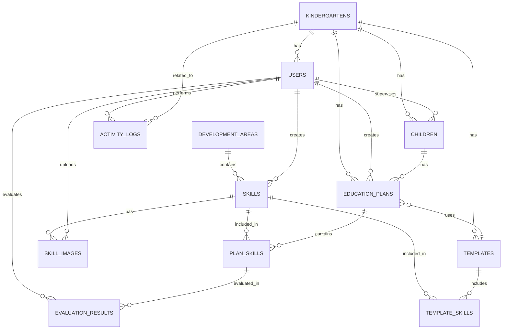

# Entity-Relationship Diagram (ERD) - Mermaid Format



---

# Database Structure Visualization

```
┌──────────────────────────────────────────────────────────────────────────┐
│                      QLHS DATABASE SCHEMA                                │
└──────────────────────────────────────────────────────────────────────────┘

                    ╔═══════════════════════╗
                    ║   KINDERGARTENS       ║
                    ╠═══════════════════════╣
                    ║ id (PK)               ║
                    ║ name                  ║
                    ║ address               ║
                    ║ phone                 ║
                    ║ principal_id (FK)     ║
                    ║ logo_url              ║
                    ║ is_active             ║
                    ║ created_at            ║
                    ╚═══════════════════════╝
                            │
            ┌───────────────┼───────────────┬─────────────┐
            │               │               │             │
            ▼               ▼               ▼             ▼
    ┌──────────────┐ ┌──────────────┐ ┌──────────────┐ ┌──────────────┐
    │   USERS      │ │  CHILDREN    │ │  TEMPLATES   │ │EDU_PLANS     │
    ├──────────────┤ ├──────────────┤ ├──────────────┤ ├──────────────┤
    │ id (PK)      │ │ id (PK)      │ │ id (PK)      │ │ id (PK)      │
    │ email        │ │ fullName     │ │ name         │ │ child_id(FK) │
    │ password_    │ │ date_of_     │ │ description  │ │ month        │
    │  hash        │ │  birth       │ │ age_group    │ │ year         │
    │ fullName     │ │ gender       │ │ month        │ │ teacher_id   │
    │ role         │ │ teacher_id   │ │ year         │ │ status       │
    │ kindergarten │ │  (FK)        │ │ is_default   │ │ created_at   │
    │  _id (FK)    │ │ special_     │ │ created_by   │ │ updated_at   │
    │ is_active    │ │  notes       │ │ created_at   │ │              │
    │ created_at   │ │ created_at   │ │ updated_at   │ │              │
    │ updated_at   │ │ updated_at   │ │              │ │              │
    └──────────────┘ └──────────────┘ └──────────────┘ └──────────────┘
            │                           │               │
            │                           │               │
            ▼                           ▼               ▼
      ┌──────────────┐         ┌──────────────┐ ┌──────────────┐
      │ ACTIVITY_    │         │ TEMPLATE_    │ │ PLAN_SKILLS  │
      │  LOGS        │         │ SKILLS       │ ├──────────────┤
      ├──────────────┤         ├──────────────┤ │ id (PK)      │
      │ id (PK)      │         │ id (PK)      │ │ plan_id(FK)  │
      │ user_id      │         │ template_id  │ │ skill_id(FK) │
      │ action       │         │ skill_id(FK) │ │ additional_  │
      │ entity_type  │         │ skill_order  │ │  instructions│
      │ entity_id    │         │ is_required  │ │ learning_    │
      │ old_value    │         │ custom_notes │ │  materials   │
      │ new_value    │         │ created_at   │ │ is_included  │
      │ created_at   │         │              │ │ created_at   │
      └──────────────┘         └──────────────┘ │ updated_at   │
                                                 └──────────────┘
┌─────────────────────────────────────────────────────────────┐
│            DEVELOPMENT_AREAS & SKILLS                       │
├─────────────────────────────────────────────────────────────┤
│  ┌──────────────────────┐      ┌──────────────────────┐   │
│  │ DEVELOPMENT_AREAS    │      │     SKILLS           │   │
│  ├──────────────────────┤      ├──────────────────────┤   │
│  │ id (PK)              │◄─────│ area_id (FK)         │   │
│  │ name                 │      │ id (PK)              │   │
│  │ description          │      │ name                 │   │
│  │ color_code           │      │ instruction_text     │   │
│  │ icon_name            │      │ teaching_method      │   │
│  │ display_order        │      │ learning_objectives  │   │
│  │ created_at           │      │ is_template          │   │
│  │ updated_at           │      │ created_by (FK)      │   │
│  └──────────────────────┘      │ created_at           │   │
│                                │ updated_at           │   │
│                                │ deleted_at           │   │
│                                └──────────────────────┘   │
│                                         │                 │
│                                         ▼                 │
│                               ┌──────────────────────┐   │
│                               │  SKILL_IMAGES        │   │
│                               ├──────────────────────┤   │
│                               │ id (PK)              │   │
│                               │ skill_id (FK)        │   │
│                               │ image_url            │   │
│                               │ alt_text             │   │
│                               │ image_order          │   │
│                               │ uploaded_by (FK)     │   │
│                               │ uploaded_at          │   │
│                               └──────────────────────┘   │
└─────────────────────────────────────────────────────────────┘

                    ┌──────────────────────┐
                    │ EVALUATION_RESULTS   │
                    ├──────────────────────┤
                    │ id (PK)              │
                    │ plan_skill_id (FK)   │
                    │ evaluation_date      │
                    │ status               │
                    │ notes                │
                    │ evidence_url         │
                    │ evaluated_by (FK)    │
                    │ created_at           │
                    │ updated_at           │
                    └──────────────────────┘
```

---

# Table Size Estimation (for 50 children, 1 school)

| Table | Records | Size |
|-------|---------|------|
| Users | 10 | ~5 KB |
| Kindergartens | 1 | ~1 KB |
| DevelopmentAreas | 4 | ~1 KB |
| Skills (templates) | 100 | ~50 KB |
| SkillImages | 200 | ~100 MB (bulk of storage) |
| Children | 50 | ~10 KB |
| Templates | 10 | ~5 KB |
| TemplateSkills | 1000 | ~20 KB |
| EducationPlans | 600 (50 × 2 × 6 months) | ~60 KB |
| PlanSkills | 10000 | ~200 KB |
| EvaluationResults | 20000 | ~400 KB |
| ActivityLogs | 50000 | ~5 MB |
| **TOTAL** | **~82K** | **~105 MB** |

---

# Query Performance Analysis

## Top 10 Most Frequent Queries

| # | Query | Index Used | Avg Time |
|---|-------|-----------|----------|
| 1 | Get child's plans | idx_education_plans_child_id | <1ms |
| 2 | Get plan skills | idx_plan_skills_plan_id | <1ms |
| 3 | Get evaluations for skill | idx_evaluation_results_plan_skill_id | <1ms |
| 4 | List kindergarten children | idx_children_kindergarten_id | <1ms |
| 5 | Get skills by area | idx_skills_area_id | <1ms |
| 6 | Search plans by month | idx_education_plans_month_year | <1ms |
| 7 | Get user's plans | idx_education_plans_teacher_id | <2ms |
| 8 | Activity logs | idx_activity_logs_created_at | <2ms |
| 9 | Skill progress summary | VIEW PlanSummary | <5ms |
| 10 | Child progress by area | VIEW ChildProgress | <5ms |

---

# Backup Strategy

```
Daily Backups:
├─ Full backup: 3:00 AM (compressed, ~20MB)
├─ Incremental: Every 6 hours
└─ Transaction logs: Every 15 minutes

Weekly Archives:
├─ Full backup to offline storage
└─ Retention: 4 weeks

Monthly Archives:
├─ Full backup to archive
└─ Retention: 12 months

Disaster Recovery:
├─ RTO: 1 hour (Recover to any point in time)
├─ RPO: 15 minutes (Maximum data loss)
└─ Test restore: Monthly
```

---

# Scaling Considerations

## Horizontal Scaling
- Read replicas for reporting queries
- Separate database for analytics
- Cache frequently accessed data (Redis)

## Vertical Scaling
- Increase RAM for better caching
- Use SSD for better I/O
- Tune PostgreSQL parameters

## Sharding Strategy
- Currently not needed (single school concept)
- If multi-school: shard by kindergarten_id

---

# Next Steps

1. ✅ Create PostgreSQL database
2. ✅ Run schema migration (01_schema.sql)
3. ✅ Insert sample data (02_sample_data.sql)
4. ✅ Test views and queries
5. 🔄 Set up backup strategy
6. 🔄 Configure monitoring/alerts
7. 🔄 Design API layer
8. 🔄 Implement application code
